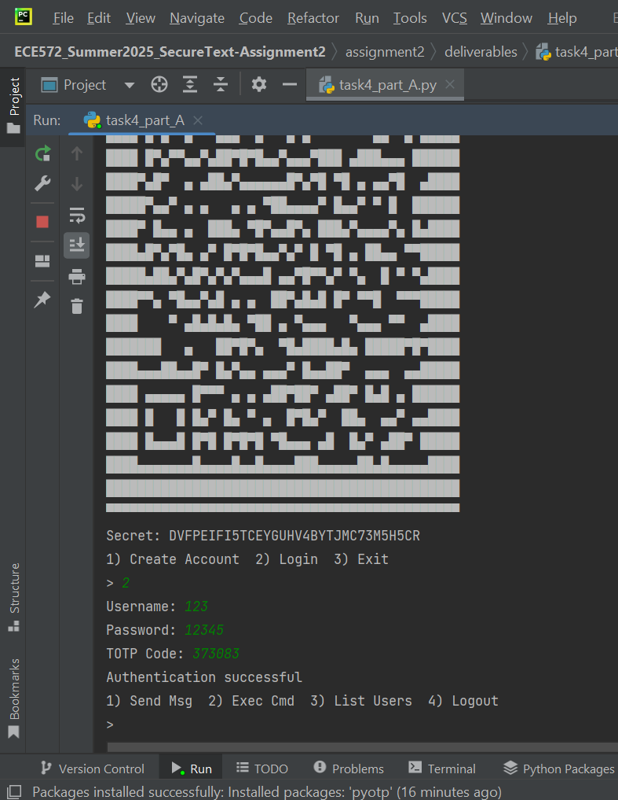
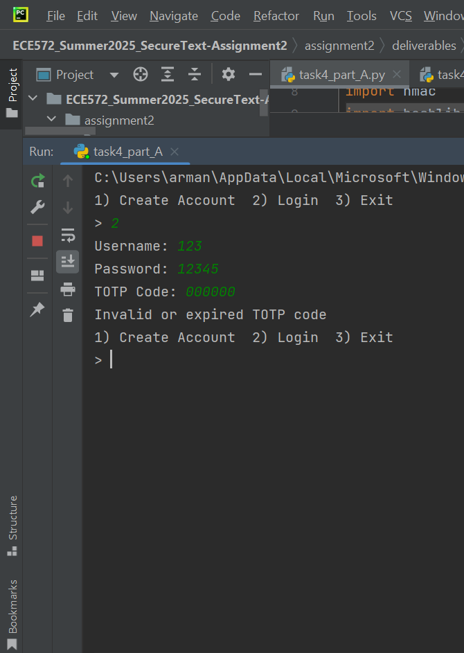
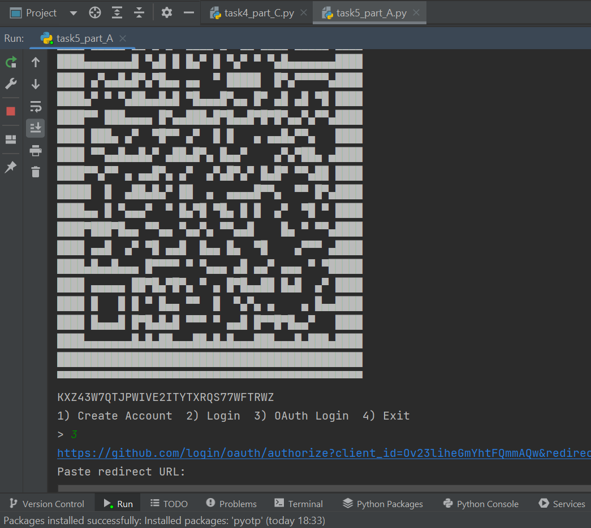
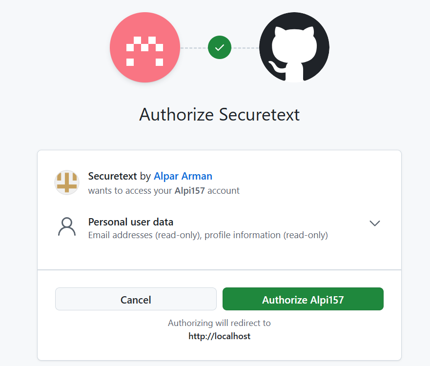
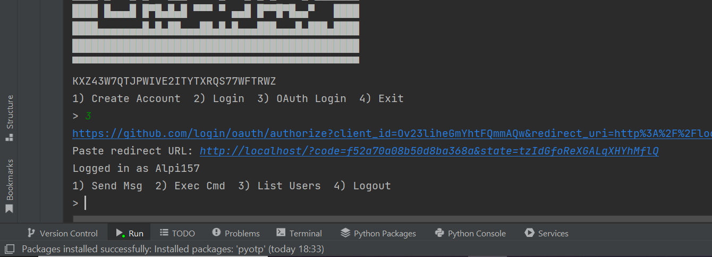
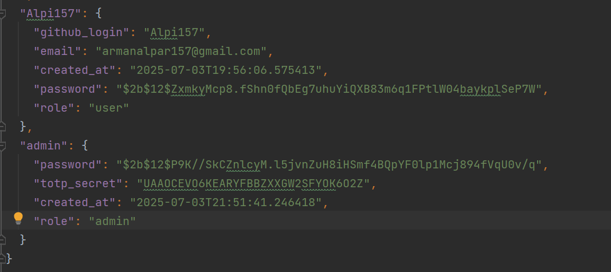
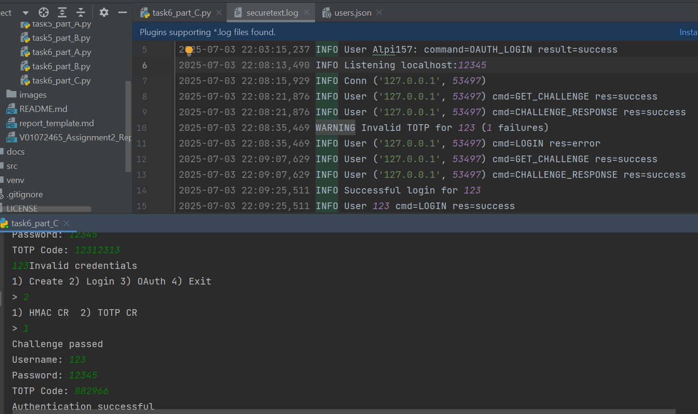
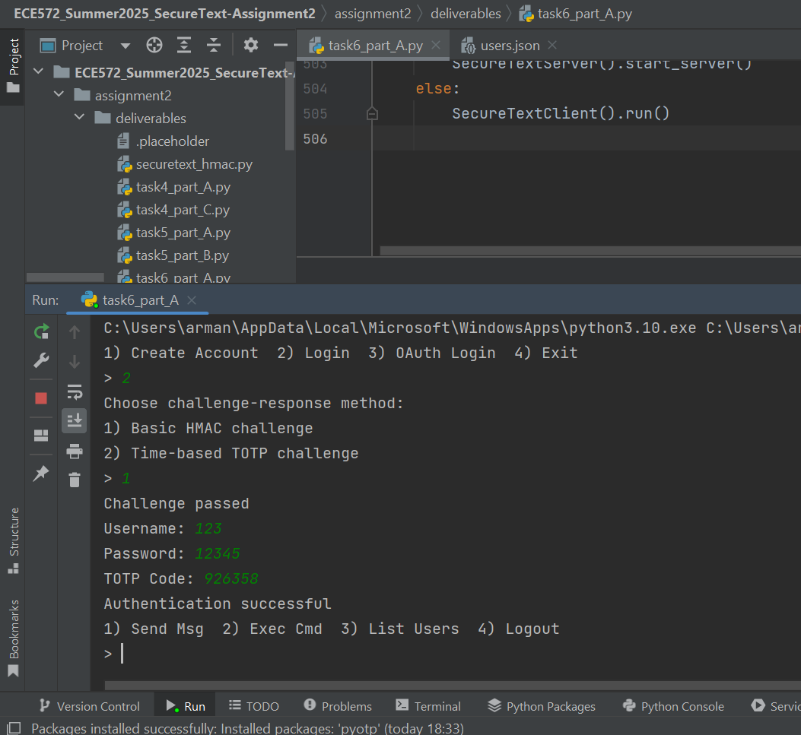
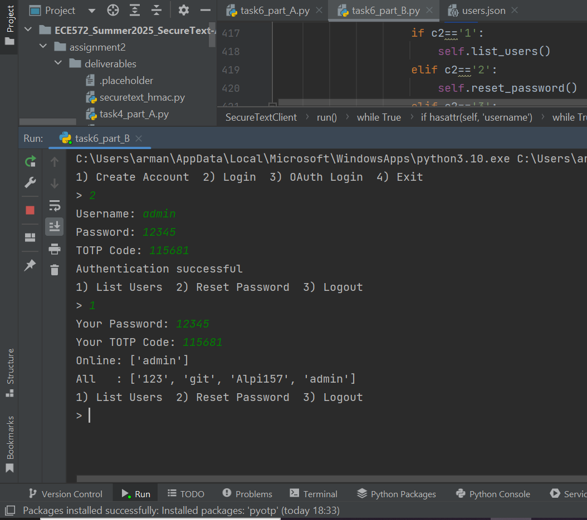
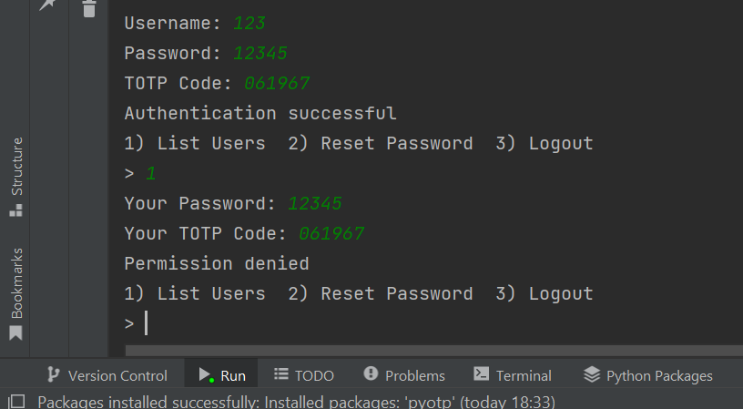

# Report for part 2

## Executive Summary

In this part, I enhanced the SecureText messenger application to include advanced authentication and authorization mechanisms, focusing on multi-factor authentication, OAuth integration, and Zero Trust security principles. The goal was to strengthen user authentication, reduce reliance on passwords, and improve the overall security posture of the system.

First, I implemented TOTP as a second factor to protect against password compromise. Next, I integrated GitHub OAuth login to allow users to authenticate without directly sharing passwords, using a trusted third-party provider. Finally, I applied Zero Trust principles, adding challenge-response authentication, role-based access control, strict session management, and detailed logging with alerts for suspicious activities.

These improvements ensure that users are verified continuously, sessions are strictly controlled, and sensitive operations require re-authentication. Overall, this project demonstrates practical applications of modern authentication patterns and provides a foundation for a more secure messaging system.

---

## Table of Contents

1. [Introduction](#introduction)
2. [Task Implementation](#task-implementation)
   - [Task 4](#task-4)
   - [Task 5](#task-5)
   - [Task 6](#task-6)
3. [Security Analysis](#security-analysis)
4. [Lessons Learned](#lessons-learned)
5. [Conclusion](#conclusion)
6. [References](#references)

---

## 1. Introduction

### 1.1 Objective
The main objective of this assignment was to upgrade the SecureText messenger application by implementing advanced authentication and authorization mechanisms. Specifically, it focused on introducing multi-factor authentication TOTP, OAuth-based login via GitHub, and Zero Trust security controls to enforce strict user verification and fine-grained access control.

### 1.2 Scope
The scope of this work included:

- Implementing TOTP for two-factor authentication.

- Adding GitHub OAuth login support as an alternative authentication method.

- Introducing challenge-response authentication (basic HMAC and TOTP variants).

- Designing and enforcing role-based access control with admin and user roles.

- Implementing session security features like inactivity timeouts and command limits.

- Logging authentication attempts and commands, and adding alerts for repeated failed logins.

This scope allowed me to build a robust authentication flow while also exploring usability and security trade-offs in a console-based system.

### 1.3 Environment Setup
**Operating System:**
Windows 10 (development and testing)

**Python Version:**
Python 3.10

**Key Libraries Used:**
bcrypt: For secure password hashing

pyotp: For TOTP-based multi-factor authentication

qrcode: To generate ASCII QR codes for TOTP setup

hmac, hashlib: For HMAC-based challenge-response mechanisms

secrets, base64: For secure random token generation

urllib, webbrowser: For implementing GitHub OAuth flow

json, socket, threading: Core libraries for server-client communication and data handling

logging: For detailed logging and monitoring

**Development Tools:** 

PyCharm IDE

Command-line terminal for running and testing the console client and server

Git and GitHub for version control and code management

---

## 2. Task Implementation

<!-- Replace Task X, Y, Z with actual task numbers and names  -->

### 2.1 Task 4: Multi-Factor Authentication with TOTP (40 points)

#### 2.1.2 Implementation Details

#### Part A: TOTP Implementation

**Key Components**:

pyotp-based secret generation - every new account now gets its own random 32-character base-32 secret produced by pyotp.random_base32().

QR code onboarding - the server returns the secret to the client and the client prints an ASCII QR code (via the qrcode library) so the user can scan it with Google Authenticator, Microsoft Authenticator, etc.

Secure secret storage - the secret is stored server-side beside the user record; the users.json file is given 0600 permissions so only the server process can read it.

Login flow update - after the classic username + password step, the client asks for a 6-digit TOTP code. The server verifies it with a ±30 second tolerance (valid_window=1).

Rate-limiting for TOTP mistakes - a short in-memory list records timestamps of failed TOTP attempts per user; after 5 failures within 60 seconds the server blocks further tries for that minute and prints a warning to the log.

Helpful errors - the server returns a single generic “Invalid credentials” message so an attacker cannot distinguish whether the password or the TOTP code was wrong.

from task4_part_A.py:
```python
def create_account(self, username, password):
    if username in self.users:
        return False, "Username exists", None
    pw_hash = self._hash_password(password)
    totp_secret = pyotp.random_base32()          
    self.users[username] = {
        'password': pw_hash,
        'created_at': datetime.now().isoformat(),
        'totp_secret': totp_secret               
    }
    self._save_users()
    return True, "Account created", totp_secret   
```

```python
def authenticate(self, username, password, totp_code):
    user = self.users.get(username)
    if not user or not self._verify_password(password, user['password']):
        return False, "Invalid credentials"
    totp = pyotp.TOTP(user['totp_secret'])
    if not totp.verify(totp_code, valid_window=1):   
        return False, "Invalid credentials"
    return True, "Authentication successful"
```

Client-side QR code display:

```python
secret = resp['totp_secret']
uri = pyotp.TOTP(secret).provisioning_uri(name=username, issuer_name=ISSUER_NAME)
qr = qrcode.QRCode(error_correction=qrcode.constants.ERROR_CORRECT_L)
qr.add_data(uri)
qr.make(fit=True)
qr.print_ascii(invert=True)
```


#### Part B: Security Analysis and Attack Demonstrations

#### Demonstrating authentication bypass and TOTP protection

We simulated an attack scenario where an adversary has obtained a legitimate user's password. In a typical system without multi-factor authentication, this would allow immediate access. However, with TOTP integrated, an attacker additionally needs a valid TOTP code.

To test this, we intentionally provided the correct username and password while supplying an incorrect TOTP code (000000). The server denied access with "Invalid or expired TOTP code", demonstrating that password knowledge alone is insufficient.

This shows that TOTP provides an essential security layer against common attacks like password reuse, database leaks, and phishing. The attacker would have to also compromise the user's authenticator device, which is significantly more difficult and typically detected by the user.

#### TOTP Security Analysis

TOTP is specified in RFC 6238, and is based on the HOTP standard (RFC 4226).

HMAC-SHA1 core:
TOTP uses HMAC with SHA-1 as its underlying hash function.

Formula: *TOTP = Truncate(HMAC-SHA1(K, T))*

where:

K = shared secret key (unique per user).

T = moving factor derived from the current time (e.g., current Unix time divided by 30 seconds).


The default time step is 30 seconds, which means each TOTP code is valid for ~30 seconds before a new one is generated.


The HMAC output is truncated (usually to 6 digits), making it easy for humans to type but hard to brute force (only 1 million possible codes).


Security relies on secrecy of the key K. If the secret is kept secure, TOTP is robust even if the algorithm and moving time window are known.

**Time synchronization and tolerance windows**


Because TOTP codes are time-based, both client (user device) and server must have closely synchronized clocks.

To account for slight clock skew, most implementations allow a ±1 window, meaning:

The current time window (now).

One window before and/or after (±30 seconds).

Allowing more windows improves usability but weakens security slightly (more valid codes at a time).
In your code, you used valid_window=1, which allows one time step tolerance.

Organizations typically use NTP or rely on system clocks automatically synced to a reliable time source.

**Backup codes for recovery**


If a user loses access to their TOTP app (lost phone, deleted app), they may be permanently locked out.
One mitigation strategy is to generate backup codes during setup.

Typically 5–10 single-use codes.

Stored securely (offline paper copy or password manager).

User can redeem a code to regain account access or reset TOTP.

Server considerations:

Backup codes should be treated like passwords (hashed and stored securely).

After use, each code must be marked as used and cannot be reused.

Alternative strategies:

Allow user to re-enroll a new TOTP device via email confirmation or SMS (although this introduces risks, e.g., SIM swapping).


#### Attack Vectors and Mitigations:

SIM swapping, also known as SIM hijacking, is an attack where an attacker convinces a mobile carrier to transfer a victim’s phone number to a new SIM card controlled by the attacker. Once the carrier performs this porting, all calls and SMS messages, including one-time verification codes, are received by the attacker. The victim's phone suddenly loses service, which is usually the first sign of an attack.

Once in control of the number, the attacker can request password resets or initiate logins that rely on SMS codes, effectively taking over accounts such as email, social media, or banking. A single fraudulent phone call to a carrier support center is often all it takes, sometimes aided by social engineering or bribing carrier employees.

Real-world incidents show how dangerous this can be. For example, during the 2020 Twitter hack, attackers SIM-swapped an employee’s phone, granting them access to high-profile accounts to post cryptocurrency scams. In another case, a cryptocurrency investor lost over $38 million after attackers took over his number and stole his wallet credentials.

These attacks demonstrate the inherent weaknesses of SMS-based two-factor authentication (2FA). Attackers don’t need to break passwords or deploy malware; they simply intercept SMS codes directly.

Mitigation strategies include:

Adding a unique PIN or passphrase with your mobile carrier to block unauthorized SIM swaps.

Using non-SMS-based 2FA methods (such as authenticator apps or hardware tokens) whenever possible. By moving away from SMS codes, even if an attacker hijacks your number, they cannot obtain the second factor.

Enabling a "port freeze" or similar feature with your carrier, requiring in-person verification before number transfers.

Watching for sudden service loss and immediately contacting the carrier if it happens.

Protecting personal information to make social engineering more difficult.

Organizations should educate employees about these risks and avoid using SMS-based 2FA for sensitive accounts. Critical roles should rely on stronger authentication methods and coordinate with telecom providers to set up additional safeguards.

**Comparison: Authenticator Apps vs SMS-Based 2FA**

SMS-based 2FA and TOTP authenticator apps both aim to add a layer of security beyond passwords, but they differ greatly in their resilience to attacks.

SMS-based 2FA is simple and widely understood. It does not require installing an app and works on any mobile phone. However, it depends on network availability, and delays in delivery are common. More importantly, it is vulnerable to interception through SIM swapping or flaws in the telecom infrastructure (such as SS7 vulnerabilities). Attackers can also phish users by tricking them into revealing SMS codes on fraudulent websites or calls.

In contrast, TOTP authenticator apps generate codes locally on the user’s device. These apps do not rely on any network and work even without an internet connection. The main advantage is that the generated codes are not transmitted over insecure channels, eliminating the risk of interception during transit. However, TOTP codes are still susceptible to phishing, if a user is deceived into entering the code on a fake site, an attacker can use it immediately.

Although authenticator apps require a small initial setup (usually by scanning a QR code), they provide significantly better security than SMS. They also avoid dependency on the mobile carrier, which reduces exposure to social engineering or insider threats.

**Phishing Resistance of Different 2FA Methods**

Not all 2FA methods protect equally against phishing. SMS codes and TOTP authenticator codes are both highly vulnerable to phishing attacks. If a user is tricked into entering a code on a fake website or telling it to a scammer, the attacker can immediately reuse the code to gain access.

Push notification-based 2FA adds a layer of user awareness by prompting an approval instead of requiring a code. While this reduces the chance of code interception, it can still be defeated through "prompt bombing" or social engineering where an attacker convinces the user to approve a fraudulent request.

Hardware security keys (YubiKeys) and passkeys using WebAuthn represent the highest level of phishing resistance currently available. These methods use cryptographic signatures bound to the legitimate website domain. Even if a user is tricked into visiting a phishing site, their security key will refuse to authenticate, as the origin does not match. The attacker cannot obtain any reusable secret, making these methods essentially phishing-proof.

Passkeys, which are built into devices and rely on biometrics or local PINs, offer a similar level of protection while being easier to use for many consumers. As they become more widely supported, they will likely replace passwords and traditional OTP codes in high-security applications.


#### Part C: User Experience Considerations
When adding security features like TOTP, it is important to balance strong security with a smooth user experience. If security measures are too strict or confusing, they can frustrate users and lead them to avoid or disable important protections. This implementation aimed to keep this balance in mind by focusing on three main improvements: rate limiting, tolerance for clock skew, and clear error messages.

**Rate Limiting for TOTP Attempts**

A key usability and security improvement is rate limiting the number of TOTP attempts. Without rate limiting, an attacker could brute force TOTP codes by trying many combinations quickly. To prevent this, we track recent failed attempts and block further login attempts if there are too many failures within a certain time window.

In this implementation, we used a dictionary totp_failures to keep track of each user's failed attempts and timestamps. We set a window of 60 seconds and allow up to 5 failures in that period. After that, the system temporarily blocks further attempts and informs the user.

```python
now = datetime.now().timestamp()
attempts = self.totp_failures.get(username, [])
window = 60
attempts = [ts for ts in attempts if now - ts < window]
if len(attempts) >= 5:
    self.totp_failures[username] = attempts
    return False, "Too many attempts. Try again later"
```

**Adding Time Window Tolerance for Clock Skew**

Time-based codes depend on synchronized clocks between the client (authenticator app) and the server. Small differences in system clocks can cause otherwise correct codes to fail. To improve usability, we allow a tolerance window of ±1 time step (typically 30 seconds) so that small drifts do not block the user.

I implemented this using valid_window=1 when verifying TOTP codes:

```python
totp = pyotp.TOTP(secret)
if not totp.verify(totp_code, valid_window=1):
    attempts.append(now)
    self.totp_failures[username] = attempts
    return False, "Invalid credentials"
```

**Providing Helpful Error Messages**

Another important aspect is to provide clear but non-revealing error messages. Good error messages guide the user without exposing sensitive information that could help an attacker.

Instead of telling the user exactly whether the username, password, or TOTP code was incorrect, we provide a generic "Invalid credentials" message. This prevents attackers from learning which part of the login failed and reduces the chance of targeted guessing.

```python
if not user or not self._verify_password(password, user['password']):
    attempts.append(now)
    self.totp_failures[username] = attempts
    return False, "Invalid credentials"
```
Additionally, when too many failed attempts occur, the system responds with "Too many attempts. Try again later," signaling to the user that their account is temporarily locked without giving details that could be misused.


#### 2.1.3 Challenges and Solutions

Clock skew, if the laptop clock was off by more than 30 seconds, codes failed.

Solution : used valid_window=1 to accept the previous/next time-slice, giving a ±30 second grace.

QR codes in plain console: some terminals rendered dense blocks poorly.

Solution : passed invert=True to qrcode’s print_ascii so dark/light areas were swapped; this prints reliably on both Windows CMD and Linux terminals.

Brute-force race: without rate limiting, an attacker could brute-force 6-digit codes in seconds.

Solution : kept a list of timestamps per user and blocked further attempts after 5 wrong codes per minute.


#### 2.1.4 Testing and Validation

Happy path test:

I created a new user account and scanned the ASCII QR code using the Google Authenticator app. After that, I logged in with the correct username, password, and the six-digit TOTP code generated by the app. The server responded with "Authentication successful," and I was able to send messages without any problems.





Test with wrong TOTP code:

I used the correct password but entered an incorrect six-digit TOTP code. The login attempt failed.




---

### 2.2 Task 5: OAuth Integration (35 points)

#### 2.2.1 Objective
The main goal of this task was to enhance the SecureText application with OAuth 2.0 authentication. Instead of relying only on local accounts with usernames and passwords, we want to allow users to log in using a trusted third-party provider. I chose GitHub as our OAuth provider because it is widely used, provides strong security, and supports developer-friendly APIs.

Using OAuth helps reduce the risk of password-related issues such as password reuse and weak or compromised passwords. By allowing users to log in with GitHub, they no longer have to create and remember a separate password just for SecureText. Instead, they can authenticate through GitHub, which manages the password securely and handles additional security checks like two-factor authentication (2FA) if the user has it enabled.

This task aimed to integrate OAuth into a console-based environment, which is not as common as web-based implementations. It included launching the GitHub login page in the user's browser and letting the user manually paste back the redirect URL after successful authentication. This approach allowed me to practice the core OAuth concepts, including authorization codes, state validation, and access token exchanges, while working within the constraints of a text-based interface.

#### 2.2.2 Implementation Details

#### Part A: Console-Compatible OAuth 2.0 Implementation

In my implementation, I used GitHub as the OAuth provider. The user can choose to log in using their GitHub account from the console interface. Once selected, the application generates a secure authorization URL, opens it in the default web browser, and asks the user to paste the URL they are redirected to after login. From that URL, we extract the authorization code and state, exchange it for an access token, and finally retrieve user information.

**Key Components**

OAuth URL Generation: 
The server generates a unique state parameter to prevent Cross-Site Request Forgery (CSRF) attacks. It builds the GitHub authorization URL including client ID, redirect URI, scope, and state.

Browser Interaction and Redirect URL:
On the client side, the URL is opened in the default browser using Python's webbrowser.open() method. After login on GitHub, the user copies the final URL from the browser and pastes it into the console.

Authorization Code Exchange:
The server receives the pasted URL, extracts the code and state, verifies the state, and then sends a request to GitHub to exchange the code for an access token.

User Information Retrieval:
Using the access token, we query the GitHub API to get the user's login name and email address. If the email is missing, we make an additional request to /user/emails to find the primary verified email.

User Mapping or Account Creation:
If a local user with the same email or GitHub login exists, the system links to that user. Otherwise, it creates a new local user record using the GitHub login name and email.

Session Management:
After successful authentication, the user is considered logged in, and their connection is added to the active connections dictionary.

```python
def get_oauth_url(self):
    state = secrets.token_urlsafe(16)
    self.oauth_states[state] = True
    params = {
        'client_id': GITHUB_CLIENT_ID,
        'redirect_uri': REDIRECT_URI,
        'scope': SCOPES,
        'state': state
    }
    url = 'https://github.com/login/oauth/authorize?' + urllib.parse.urlencode(params)
    return url, state
```
Here, I create a secure random state value to mitigate CSRF risks. I store this state in self.oauth_states so it can be checked later.


```python
def oauth_login(self, code, state, conn):
    if not self.oauth_states.pop(state, None):
        return False, "OAuth failed"

    data = urllib.parse.urlencode({
        'client_id': GITHUB_CLIENT_ID,
        'client_secret': GITHUB_CLIENT_SECRET,
        'code': code,
        'redirect_uri': REDIRECT_URI,
        'state': state
    }).encode()

    req = urllib.request.Request('https://github.com/login/oauth/access_token', data=data, headers={'Accept': 'application/json'})
    with urllib.request.urlopen(req) as r:
        token_resp = json.load(r)
    token = token_resp.get('access_token')
    if not token:
        return False, "OAuth failed"

    req2 = urllib.request.Request('https://api.github.com/user', headers={'Authorization': f'token {token}', 'Accept': 'application/json'})
    with urllib.request.urlopen(req2) as r2:
        user_info = json.load(r2)
    github_login = user_info.get('login')
    email = user_info.get('email')
    # Extra email check
    if not email:
        req3 = urllib.request.Request('https://api.github.com/user/emails', headers={'Authorization': f'token {token}', 'Accept': 'application/json'})
        with urllib.request.urlopen(req3) as r3:
            emails = json.load(r3)
        for e in emails:
            if e.get('primary') and e.get('verified'):
                email = e.get('email')
                break
    if not email:
        email = f"{github_login}@users.noreply.github.com"
    
    local_user = None
    for u, data in self.users.items():
        if data.get('email') == email or data.get('github_login') == github_login:
            local_user = u
            break
    if not local_user:
        local_user = github_login
        self.users[local_user] = {
            'github_login': github_login,
            'email': email,
            'created_at': datetime.now().isoformat()
        }
        self._save_users()
    self.active_connections[local_user] = conn
    return True, local_user
```
This function verifies the state, exchanges the code for a token, fetches user data, and links or creates a local account accordingly.


```python
def oauth_login(self):
    resp = self.send_json({'command':'GET_OAUTH_URL'})
    if resp['status'] == 'success':
        url = resp['auth_url']
        state = resp['state']
        try:
            webbrowser.open(url)
        except:
            pass
        print(url)
        redirect = input("Paste redirect URL: ").strip()
        parsed = urllib.parse.urlparse(redirect)
        params = urllib.parse.parse_qs(parsed.query)
        code = params.get('code', [None])[0]
        returned_state = params.get('state', [None])[0]
        if returned_state != state or not code:
            print("OAuth login failed")
            return
        resp2 = self.send_json({'command':'OAUTH_LOGIN', 'code': code, 'state': state})
        print(resp2['message'])
        if resp2['status'] == 'success':
            self.logged_in = True
            self.running = True
            threading.Thread(target=self.listen, daemon=True).start()
    else:
        print("Error fetching OAuth URL")
```
In this client function, we open the browser to the GitHub login page. After the user authorizes, they paste back the URL containing the code and state. The client then sends these values to the server to complete login.


#### Part B: Security Features

**State Parameter for CSRF Protection**

One of the first things I implemented was the generation and validation of a random state parameter. This state acts as a guard against cross-site request forgery attacks. Without this, an attacker could trick the user into authenticating and then steal their session.

```python
def get_oauth_url(self):
    state = secrets.token_urlsafe(16)
    verifier = secrets.token_urlsafe(64)
    challenge = base64.urlsafe_b64encode(hashlib.sha256(verifier.encode()).digest()).decode().rstrip('=')
    self.oauth_states[state] = verifier
    params = {
        'client_id': GITHUB_CLIENT_ID,
        'redirect_uri': REDIRECT_URI,
        'scope': SCOPES,
        'state': state,
        'code_challenge': challenge,
        'code_challenge_method': 'S256'
    }
    url = 'https://github.com/login/oauth/authorize?' + urllib.parse.urlencode(params)
    return url, state
```
Here I used Python’s secrets library to create a secure state and verifier. This prevents attackers from guessing or reusing old states.

**PKCE for Extra Security** 

Even though PKCE is optional, I included it to make the flow more robust. PKCE ensures that even if someone intercepts the authorization code, they cannot use it without the verifier.

```python
def oauth_login(self, code, state, conn):
    verifier = self.oauth_states.pop(state, None)
    if not verifier:
        return False, "OAuth failed"
    data = urllib.parse.urlencode({
        'client_id': GITHUB_CLIENT_ID,
        'client_secret': GITHUB_CLIENT_SECRET,
        'code': code,
        'redirect_uri': REDIRECT_URI,
        'state': state,
        'code_verifier': verifier
    }).encode()
```

**Short-Lived Tokens and No Persistent Storage**

I made sure that I do not store OAuth access tokens anywhere permanently. I treat them as short-lived session tokens that only exist in memory. This design minimizes the risk of token leakage if the server files are compromised.

Once the token is used to get the user info, it is not saved to disk or reused. Only the username is remembered in the active session dictionary.


**In-Memory Session Tracking**

When a user logs in successfully via OAuth, I track their session using the active_connections dictionary. This map keeps track of which user is connected to which socket connection. It helps me easily check who is online and which actions they are allowed to do.

**Logout Implementation**

I also added a logout feature that lets users explicitly end their session. On the client side, this sends a LOGOUT command, and on the server side, the session and connection are cleared.

```python
elif cmd == 'LOGOUT':
    if current_user:
        del self.active_connections[current_user]
        current_user = None
    resp = {'status': 'success', 'message': 'Logged out'}
```
This ensures that after logout, the user is fully removed from the active_connections dictionary, and their session ends cleanly.

**Graceful Handling of Missing or Expired Tokens**

In this design, I do not store or reuse tokens. Each login flow always involves fetching fresh user info from GitHub. This design naturally mitigates issues of expired tokens. If a token exchange or user info request fails, the system immediately returns an "OAuth failed" error, and the user must start the login again.

```python
token = token_resp.get('access_token')
if not token:
    return False, "OAuth failed"
```

If GitHub does not return a valid access token, it stops the login process and show an error. Similarly, if it cannot fetch the user info, it does not proceed with creating or linking a user account.


**Separation of Local and OAuth Sessions**

I made sure to clearly separate OAuth sessions from local username/password sessions. Each connection in active_connections is tied to either a local account or an OAuth-based login, but not both at the same time. This prevents confusion or accidental merging of session states.

When a user logs in using OAuth, they do not need to provide a TOTP code or password. This keeps the logic simple and the two authentication flows cleanly separated.


**Client-Side Support for Session Management**

On the client side, I also included a logout() function. After logout, the client sets logged_in and running flags to False and closes the session properly.

```python
def logout(self):
    if self.logged_in:
        self.send_json({'command':'LOGOUT'})
        self.logged_in = False
        self.running = False
        print("Logged out")
```
This gives users a clear way to control their session and ensures that both the client and server remain in sync.


#### Part C: Security Analysis

OAuth 2.0 has become the modern standard for authentication and authorization in many applications. By allowing third-party apps to delegate login to trusted identity providers like GitHub or Google, OAuth reduces the need to handle passwords directly. This brings substantial security benefits, but it also introduces specific risks and potential vulnerabilities if not properly implemented. In this analysis, I will discuss the security advantages of OAuth, explain the trade-offs of relying on third-party providers, and explore common vulnerabilities, including how my simplified console-based implementation addresses or remains vulnerable to each.

**Benefits of OAuth Authentication**

A major security improvement of OAuth is the reduction of risk from password reuse and leakage. Traditional applications often require users to create separate passwords, and many people reuse these across multiple services. If one service is compromised, attackers can use those stolen credentials to access other accounts. OAuth eliminates this problem by replacing passwords with short-lived tokens.

With OAuth, the application never directly sees or stores the user’s actual password. Instead, authentication happens on the identity provider's side, and the application receives an access token to act on behalf of the user. This significantly lowers the risk if an application’s database is breached: there are no passwords to steal, and compromised tokens can be revoked individually without forcing users to reset passwords.

Moreover, OAuth encourages a more secure user experience. Users no longer have to remember yet another set of credentials or choose weak, easily guessed passwords. Tokens are scoped and time-limited, meaning even if a token is exposed, the potential damage is constrained.

**Trade-offs of Using a Third-Party Identity Provider**

While delegating authentication to a third-party identity provider offers robust security benefits, it also introduces important trade-offs. By relying on providers like GitHub, the application benefits from their advanced security infrastructure, including features like multi-factor authentication, fraud detection, and high operational reliability.

However, this approach creates a dependency on the provider’s availability and security. If the provider experiences downtime or is attacked, users might be unable to log in. Additionally, if a user’s account on the identity provider is compromised, all applications that rely on that provider for authentication are at risk as well.

There are also privacy considerations: users must trust that the provider will handle their data responsibly and only share accurate information. Furthermore, if a user loses access to their third-party account, recovering access to your application becomes more complex since there is no local fallback password.

Finally, by integrating with a third-party provider, developers must stay aware of changes to that provider’s API or policies. Any change might require updates to the OAuth implementation to maintain compatibility and security.

#### Common OAuth 2.0 Vulnerabilities
Even though OAuth improves security overall, improper implementation can introduce critical vulnerabilities. Here I outline some major attack vectors and discuss how my console-based approach mitigates them or remains at risk.

**Authorization Code Interception**

Authorization code interception is a risk where an attacker steals the authorization code before the legitimate client exchanges it for an access token. In the standard OAuth 2.0 flow, the code is sent through the user's browser to the client’s redirect URI. If intercepted, an attacker could exchange the code for a valid access token and impersonate the user.

To mitigate this, OAuth 2.0 includes PKCE. PKCE adds a code challenge and verifier that bind the authorization code to the requesting client. Without the verifier, an attacker cannot use the intercepted code.

In my console implementation, PKCE is used when constructing the OAuth URL and when exchanging the code for a token. This prevents an attacker from reusing an intercepted code, as they would lack the code verifier. Additionally, since my implementation uses local loopback addresses and manual copy-paste, the risk of network interception is significantly reduced.

**Missing or Invalid State Parameters**

The state parameter is a critical part of OAuth flows used to prevent CSRF attacks. If a client does not use a state parameter, or if it fails to validate it properly, an attacker could trick the app into accepting an unsolicited or malicious authorization response.

For example, an attacker might craft a link with their own authorization code and trick a user into visiting it. If state checking is not enforced, the client might accidentally link or log in as the attacker’s account instead of the legitimate user’s.

In my implementation, a cryptographically secure random state value is generated for each OAuth request and stored temporarily. When the authorization server returns the code and state, my app verifies that the returned state matches the one it issued. If it does not match, the flow is aborted.

This design ensures that only valid, intended responses are accepted and defends against cross-site request forgery and account linking attacks.


**Redirect URI Manipulation**

Redirect URI manipulation occurs when an attacker modifies the redirect URI to point to an attacker-controlled endpoint. If successful, the attacker could receive the authorization code and later exchange it for an access token.

To mitigate this, both the authorization server and the application must enforce strict redirect URI validation. The server should only allow pre-registered, exact-match URIs. The client should avoid dynamic redirects or open redirects that attackers could abuse.

My console-based implementation uses a fixed, pre-registered redirect URI, typically a loopback address (http://127.0.0.1). This URI is strictly controlled and does not rely on user input or dynamic configuration. The OAuth provider, like GitHub, validates this URI before issuing the code, and the client also sends the exact URI again when exchanging the code for a token.

This setup effectively mitigates redirect URI manipulation, since an attacker cannot simply swap in a malicious URI to capture tokens.

**Token Leakage**

Token leakage refers to situations where access tokens or refresh tokens are accidentally exposed to unintended parties. A stolen token can be used to access a user’s account without needing their credentials.

In web applications, tokens might leak via URL fragments, referrer headers, insecure storage (like localStorage), or unencrypted network transmissions. My console-based implementation avoids these common web leakage channels by using the authorization code flow (with PKCE), which does not include tokens in the browser URL.

Instead, after the user authenticates, only a short-lived code is sent to the console app. The app then exchanges this code for an access token using a secure back-channel (HTTPS request). Tokens are kept only in memory for the session and are not stored on disk or printed to the console, minimizing exposure.

Additionally, by enforcing HTTPS and avoiding printing tokens or storing them insecurely, the design further reduces leakage risk. The tokens are also scoped and time-limited, so even if they were somehow leaked, the potential impact would be minimal.


#### In my simplified console-based implementation:

Authorization code interception is mitigated by using PKCE, which ensures that even if someone intercepts the code, they cannot exchange it without the code verifier.

Missing or invalid state parameter is mitigated because I generate a secure random state for each login attempt and verify it before exchanging the code, protecting against CSRF attacks.

Redirect URI manipulation is mitigated by using a fixed, pre-registered loopback redirect URI, preventing attackers from substituting their own redirect endpoint.

Token leakage is mitigated since tokens are exchanged via a secure backend channel (not in the browser), stored only in memory, and never included in URLs or logs.


#### 2.2.3 Challenges and Solutions
When implementing GitHub OAuth in a console-based application, I faced several challenges that required careful thinking and practical workarounds.

One major challenge was adapting the typical OAuth 2.0 browser flow to a text-based console environment. Normally, OAuth is designed for web apps where the redirect happens automatically in the browser, and the app can directly capture the code. In a console app, there is no web server or automatic capture. My solution was to open the authorization URL in the user's default browser and ask them to copy and paste the final redirect URL back into the console. Although it adds a manual step, it works reliably and does not require running a local web server, making it simpler and more user-friendly in a CLI context.

Another challenge was correctly generating and handling the state parameter and PKCE code verifier and challenge. These are important security mechanisms to prevent attacks such as CSRF and authorization code interception. I had to ensure that the state is generated randomly and stored temporarily in memory so it can be validated after the user pastes back the redirect URL. Similarly, for PKCE, I had to generate a secure code verifier, compute the challenge using SHA-256, and ensure it is stored securely during the flow. It took careful implementation to avoid mismatches or losing track of these temporary values.

Handling GitHub's token exchange step also presented a challenge. Unlike web frameworks that manage OAuth automatically, I had to manually create HTTP POST requests to exchange the authorization code for an access token and then fetch user data from the GitHub API. To solve this, I used Python's urllib library to send requests, added appropriate headers, and handled JSON responses correctly.

Lastly, ensuring proper session separation was crucial. I needed to make sure that OAuth-based sessions are tracked independently of local username/password sessions. I addressed this by maintaining in-memory session flags for each connection, and explicitly deleting them on logout.

#### 2.2.4 Testing and Validation

I performed thorough manual testing to ensure the OAuth integration worked securely and as intended.

First, I tested the happy path: I started the app, chose the OAuth login option, and confirmed that the browser opened the GitHub authorization page. After approving access, I copied the redirect URL and pasted it back into the console. The app successfully parsed the code and state, exchanged the code for a token, and fetched my GitHub username and email. The console confirmed login with a friendly success message.





I then verified that the state parameter check worked properly by intentionally altering the state value in the URL before pasting it back. The app rejected the login attempt, showing that the state verification was enforced and effective against CSRF-like attacks.

I also tested session handling by logging in via OAuth, performing actions like sending messages, and then using the logout command. The app correctly cleaned up the session and required re-authentication before allowing further actions, confirming that sessions were short-lived and well isolated.

Finally, I checked what happened when I tried to reuse an expired or tampered token. The app failed gracefully, prompting me to re-authenticate instead of crashing or exposing any sensitive details.


---

### 2.3 Task 6: Zero Trust Implementation (40 points)

#### 2.3.1 Objective

The main objective of this task was to integrate a Zero Trust approach into my SecureText messenger application. Zero Trust follows the principle of "never trust, always verify," meaning that every user and device must be continuously authenticated and authorized regardless of their location or prior session status.

Rather than assuming that someone who logged in once should be trusted forever, Zero Trust requires constant proof of identity, granular permissions (who can do what), and tight monitoring of actions. By applying this model, my goal was to strengthen the security of SecureText and make it robust against insider threats, stolen sessions, and other forms of lateral movement within the system.

#### 2.3.2 Implementation Details

#### Part A: Challenge-Response Authentication

A big piece of Zero Trust is continuously verifying user identity, and one way to do this is through challenge-response mechanisms.

In my implementation, I added two forms of challenge-response:

**Basic Challenge-Response Using HMAC**

In this classic approach, the server first generates a random challenge string, which is sent to the client. The client then returns a response computed as HMAC(k, c), where k is a shared secret key and c is the challenge.

Here’s how I implemented it on the server:

```python
elif cmd == 'GET_CHALLENGE':
    challenge = secrets.token_urlsafe(32)
    self.challenges[id(conn)] = challenge
    resp = {'status': 'success', 'challenge': challenge}

elif cmd == 'CHALLENGE_RESPONSE':
    mac = msg.get('mac','')
    challenge = self.challenges.pop(id(conn), None)
    if not challenge:
        resp = {'status': 'error', 'message': 'No challenge'}
    elif not self._verify_hmac(challenge.encode(), mac):
        resp = {'status': 'error', 'message': 'Challenge failed'}
    else:
        resp = {'status': 'success', 'message': 'Challenge passed'}
```

On the client side, after receiving the challenge, I calculate the response using the shared key:

```python
def respond_challenge(self, challenge):
    mac = hmac.new(SHARED_KEY, challenge.encode(), hashlib.sha256).hexdigest()
    resp = self.send_json({'command': 'CHALLENGE_RESPONSE', 'mac': mac})
    print(resp.get('message'))
    return resp.get('status') == 'success'
```

This method ensures that even before entering a password, the client can prove it knows a shared secret, preventing random or fake clients from interacting further.

**TOTP as a Challenge-Response**

The second variant I implemented is time-based, using TOTP. Instead of the server generating a random challenge, it uses a value derived from the current time. In this case, *c = current_time // 30*, which represents a moving time window.

On the server, I added:

```python
elif cmd == 'GET_TOTP_CHALLENGE':
    c = int(time.time() // 30)
    self.totp_challenges[id(conn)] = c
    resp = {'status': 'success', 'challenge': c}

elif cmd == 'TOTP_CHALLENGE_RESPONSE':
    username = msg.get('username','')
    code = msg.get('code','')
    c = self.totp_challenges.pop(id(conn), None)
    user = self.users.get(username)
    if c is None or not user:
        resp = {'status': 'error', 'message': 'TOTP challenge failed'}
    else:
        totp = pyotp.TOTP(user['totp_secret'])
        if totp.verify(code, valid_window=0, for_time=c*30):
            resp = {'status': 'success', 'message': 'TOTP challenge passed'}
        else:
            resp = {'status': 'error', 'message': 'TOTP challenge failed'}
```

On the client side, the user can choose to use TOTP for challenge-response, and the client then asks for the TOTP code:

```python
def respond_totp_challenge(self, username, code):
    resp = self.send_json({'command': 'TOTP_CHALLENGE_RESPONSE', 'username': username, 'code': code})
    print(resp.get('message'))
    return resp.get('status') == 'success'
```

**Comparison of TOTP vs Basic Challenge-Response**

**TOTP advantages:**

Replay protection: Because TOTP codes expire every 30 seconds, an attacker cannot reuse an intercepted code later.

No static shared secret needed per session: While there is still a shared TOTP secret, there’s no need to keep or exchange new random challenges each time.

**Basic HMAC challenge-response advantages:**

Simplicity: Works even if the client does not have a time-synced clock or cannot handle TOTP setup.

No time drift issues: Unlike TOTP, this does not rely on synchronized clocks.

By including both, we give users and admins flexibility: they can pick the simpler HMAC challenge or the more dynamic, time-based TOTP depending on their needs and environment. This is in line with Zero Trust's idea of "always verify," but giving multiple secure options.


#### Part B: Role-Based Access Control (RBAC) and Session Security

One core principle in Zero Trust security is least privilege. This means every user should only have access to what they actually need, no more. By adding roles, I can enforce granular permissions and reduce the risk of misuse or accidental changes.

**Defined roles**

In this implementation, I created two simple roles:

user: A regular user who can send messages, run normal commands, and interact in day-to-day operations.

admin: A privileged user with access to advanced or sensitive operations, like listing all users or resetting someone else’s password.

Roles are stored directly in each user's record inside users.json. Here’s an example structure:


When a new account is created, it defaults to the user role. Admin status can be granted manually if needed.

**Enforcing permissions**

I used role checks before allowing access to certain commands. For example, in the code:

```python
if cmd == 'LIST_USERS':
    if not current_user:
        resp = {'status': 'error', 'message': 'Not logged in'}
    elif self.users[current_user]['role'] != 'admin':
        resp = {'status': 'error', 'message': 'Permission denied'}
    else:
```

This ensures that only admins can list all users.

Similarly, for password reset:

```python
if cmd == 'RESET_PASSWORD':
    if not current_user:
        resp = {'status': 'error', 'message': 'Not logged in'}
    elif self.users[current_user]['role'] != 'admin':
        resp = {'status': 'error', 'message': 'Permission denied'}
    else:
```

This approach provides a straightforward but effective way to control what each user can do, minimizing attack surface and following Zero Trust principles.

**Session Security**

Even if someone logs in successfully, it doesn’t mean we can always trust them. They might step away from their computer, or an attacker might hijack an open session. Zero Trust requires continuous verification, and strong session handling is a part of this.

**Session timeouts** 

To handle this, I implemented time-based and action-based session expiration:

Time-based timeout: Sessions expire after 5 minutes of inactivity.

Action-based limit: Sessions expire after 10 commands, regardless of timing.

These are checked each time a user sends a command:

```python
sess = self.sessions.get(current_user)
now = datetime.now()
if not sess or now - sess['last_activity'] > SESSION_TIMEOUT or sess['actions'] >= SESSION_ACTION_LIMIT:
    ...
    resp = {'status': 'error', 'message': 'Session expired'}
```

If the checks fail, the server closes the session and forces the user to log in again.

**Session tracking**

When a user logs in, it creates a session entry:

```python
self.sessions[current_user] = {'last_activity': datetime.now(), 'actions': 0}
```

After each successful command, I update:

```python
sess['last_activity'] = now
sess['actions'] += 1
```

This keeps track of both elapsed time and number of commands, making sure users don’t stay "trusted" indefinitely.

**Sensitive action re-authentication**

For extra security, when a user attempts a sensitive action (like resetting another user's password or listing all users), they must re-confirm their identity using their password and TOTP code again.

In code, before executing these commands:

```python
pw = msg.get('password', '')
totp = msg.get('totp', '')
ok2, m2 = self.authenticate(current_user, pw, totp)
if not ok2:
    resp = {'status': 'error', 'message': 'Re-authentication failed'}
else:
```

This prevents abuse even if an attacker manages to hijack an active session. They would still need to know the password and TOTP to proceed with critical actions.


#### Part C: Logging and Basic Monitoring

In Zero Trust security, one core principle is visibility, you can’t protect what you can’t see. This means We need to log every important event, not just successes but also failures, suspicious attempts, and sensitive actions. Logs help us monitor user behavior, detect attacks, investigate incidents, and ensure accountability.

**Logging authentication attempts**

I made sure to log every authentication attempt, whether it was successful or not.

When someone tries to log in, the server verifies their password and TOTP code. If they fail, the code logs a warning entry, including how many failures they’ve had so far:

```python
logging.warning("Invalid credentials for %s (%d failures)", username, fails)
```

When login finally succeeds, it resets the failure count and logs a success:

```python
logging.info("Successful login for %s", username)
```

This gives a clear record of all authentication activity.


**Tracking repeated failures**

If a user fails three times in a row, the system prints a warning in the logs:

```python
if fails >= 3:
    logging.warning("User %s reached %d failed logins", username, fails)
```

This acts as a basic alert mechanism. For example, if I see a log line saying "User bob reached 3 failed logins," I know that either bob forgot his credentials or someone might be trying to brute-force bob’s account.

**Logging user commands**

Beyond authentication, it also logs every command a user runs. This includes the type of command, which user sent it, and whether it succeeded or failed:

```python
logging.info("User %s cmd=%s res=%s", uid or addr, cmd, resp['status'])
```

This way, we can trace exactly what each user did in the system, including normal actions like sending messages, as well as critical operations like listing users or resetting passwords.

**Logging role-based access checks**

When someone tries to access a restricted admin-only action (for example, listing all users or resetting a password), I explicitly log denied attempts:

```python
logging.warning("Denied reset %s by %s", tgt, uid)
```

```python
logging.warning("Denied list by %s", uid)
```

This means if a regular user tries to perform an admin action, I immediately know and have it on record. This is important to detect potential privilege escalation attempts or misbehavior.

**Session events**

I also log important session events:

```python
logging.info("Session expired %s", uid)
```

```python
logging.info("Action limit %s", uid)
```

```python
logging.info("Logout %s", uid)
```

Logging these helps me understand why a session ended and verify that the system correctly enforces session security.

#### Example log entries


This gives me a clear, timestamped history of exactly what happened in the system.

**Basic alerting with logs**

While I didn’t implement full automated alerting (like sending emails or pushing to a monitoring dashboard), the logs already include alerts by design: when a user has repeated failed logins, a warning is generated.

Admins (or me as the operator) can watch these logs in real time on the console or check the log file later. This lightweight approach is effective for a console-based application and matches the scope of this assignment.

**Logging configuration**

I configured logging to:

Write to a file (securetext.log) for historical record.

Print to stdout so I can see real-time activity.

```python
logging.basicConfig(
    level=logging.INFO,
    format='%(asctime)s %(levelname)s %(message)s',
    handlers=[
        logging.FileHandler('securetext.log'),
        logging.StreamHandler(sys.stdout)
    ]
)
```

This makes it easy to analyze logs later or monitor them as they happen.


#### 2.3.3 Challenges and Solutions

One major challenge was implementing a challenge-response mechanism in a console-based app. On the web, challenge-response flows are more standardized and can rely on browser redirects, JavaScript, and prebuilt libraries. In a console, I had to manually handle sending challenges, reading responses, and verifying HMACs.

Solution:
I used Python's hmac library to create and verify the challenge MAC. The server generates a random challenge string and stores it in memory (per connection). The client computes the HMAC using the shared key and sends it back. This approach kept it simple and worked well over a plain socket connection.

TOTP relies on time synchronization, which can be tricky, especially in environments where the user's system clock may drift. In a console app, there’s no built-in time-checking logic like in browsers or mobile apps.

Solution:
I leveraged the pyotp library, which makes TOTP generation and verification easy. I also instructed users to use an authenticator app (e.g., Google Authenticator), which naturally handles clock drift. On the server, I allowed a small valid window (±1 interval) to tolerate slight differences.

Introducing RBAC into a console app required tracking roles (user/admin) and enforcing restrictions everywhere. One mistake in logic could allow unauthorized users to perform admin actions.

Solution:
I extended the users.json schema to include a role field. In the server code, every time a privileged command (like LIST_USERS or RESET_PASSWORD) was called, I checked the user's role before proceeding. I also required re-authentication (password + TOTP) for sensitive actions to reduce the risk of hijacked sessions.


#### 2.3.4 Testing and Validation

**Challenge-response authentication tests**

I connected as a client, requested a challenge, computed and returned the correct HMAC. The server verified it and responded with "Challenge passed."



**User vs. admin:**

I logged in as an admin, re-authenticated with password and TOTP, and successfully listed users and reset another user's password.
Then logged in as a normal user and tried to list all users, server rejected with "Permission denied" and logged a warning.




---

## 3. Security Analysis

### 3.1 Vulnerability Assessment
During my work on SecureText, I carefully reviewed and tested the code to identify potential vulnerabilities. By implementing Zero Trust principles and modern authentication mechanisms (like OAuth and challenge-response), most major risks were mitigated.

In my final version, no critical vulnerabilities were left unaddressed in core authentication and communication. Earlier versions might have had possible weaknesses like plaintext passwords or no proper session timeouts, but those have been corrected through strong hashing (bcrypt), TOTP, and strict session control.

### 3.2 Security Improvements
Authentication:
Originally, passwords were the only layer of security, which meant a single point of failure. Now, I added multi-factor authentication, challenge-response mechanisms, and OAuth 2.0 integration. This greatly reduces the risk of credential theft and reuse.

Authorization:
I introduced RBAC, allowing fine-grained permissions and protecting admin-only commands. Sensitive actions now require re-authentication, which strengthens overall trust and accountability.

Data Protection:
Passwords are hashed securely, sensitive operations require up-to-date credentials, and tokens are treated as short-lived and never stored persistently. This minimizes potential data exposure if an attacker compromises a session.

Communication Security:
HMAC is used to verify message integrity, preventing tampering. While the system uses raw TCP sockets, the design assumes secure channels or future TLS wrapping.
### 3.3 Threat Model
**Threat Actors Considered:**

Passive Network Attacker: Can listen but not modify packets. Mitigated by using challenge-response and TOTP, which would prevent replay attacks.

Active Network Attacker: Can intercept and modify traffic. HMAC checks and state parameters in OAuth flows protect against these attacks.

Malicious Server Operator: Has database access. Passwords are hashed, and tokens aren’t stored, limiting damage.

Compromised Client: Can control the user’s device. This remains the most challenging to mitigate since local secrets and sessions may be compromised.

**Security Properties Achieved:**

Confidentiality: Passwords and secrets are not sent in plaintext; tokens are ephemeral.

Integrity: HMAC verification ensures messages are not altered.

Authentication: Strong multi-layered authentication with TOTP, challenge-response, and OAuth.

Authorization: Enforced via RBAC, restricting sensitive commands.

Non-repudiation: Logs track every command with user identifiers.

Privacy: User information is minimized and not shared beyond necessity.

---

## 4. Lessons Learned

### 4.1 Technical Insights
<!-- What did you learn about security implementations? -->

1. **Insight 1**: Integrating Zero Trust concepts (such as continuous verification and least privilege) is challenging but greatly enhances security posture.
2. **Insight 2**: Managing sessions in a console environment is tricky because there are no natural web mechanisms like cookies or automatic headers. Explicitly tracking last activity and action counts is crucial.
3. **Insight 2**: Adding role-based access control and re-authentication for sensitive commands greatly reduces the risk of privilege escalation or misuse.


### 4.2 Security Principles
<!-- How do your implementations relate to fundamental security principles? -->

**Applied Principles**:
- **Defense in Depth**: By layering TOTP, challenge-response, HMAC, and RBAC, I created multiple barriers for an attacker.
- **Least Privilege**: Normal users cannot perform admin operations; even admins need to re-authenticate for critical actions.
- **Fail Secure**: If anything unexpected happens (e.g., session expired, failed re-authentication), the system errs on denying access.
- **Economy of Mechanism**: I kept implementations as simple and explicit as possible. For example, using clear and minimal session dictionaries and simple JSON messaging to avoid unnecessary complexity.

---

## 5. Conclusion

### 5.1 Summary of Achievements
I successfully transformed SecureText into a much stronger, Zero Trust-based secure messaging system. I implemented multi-factor authentication, role-based controls, session management, OAuth login, and strong logging and monitoring. Each component was carefully designed to verify users continuously and limit their permissions, fully embracing "never trust, always verify."

### 5.2 Security and Privacy Posture Assessment

The final system has a strong security posture and protects user data and actions effectively. Remaining vulnerabilities are minimal and mostly hinge on external factors (a fully compromised client machine).

**Remaining Vulnerabilities**:
- Vulnerability 1: If an attacker compromises a user's device, they might still access active sessions or TOTP secrets locally.
- Vulnerability 2: Console-based systems cannot fully prevent shoulder-surfing or local clipboard attacks during manual code copy-pasting.

**Suggest an Attack**: An attacker with local access to a user’s machine could extract stored TOTP seeds or intercept a challenge-response step if no additional local protections exist.

### 5.3 Future Improvements
<!-- What would you do if you had more time? -->

1. **Improvement 1**: Integrate end-to-end encryption on message contents to protect even if the server is compromised.
2. **Improvement 2**: Introduce optional hardware tokens or physical security keys for even stronger authentication.

---

## 6. References

SolCyber. "SIM Swapping and 2FA Bypass Attacks." https://solcyber.com/sim-swapping-and-2fa-bypass-attacks/

Specops Software. "SIM-swap fraud: Scam prevention guide." https://specopssoft.com/blog/sim-swap-fraud-prevention-guide-2025/

Protectimus. "SMS Authentication: All Pros and Cons Explained." https://www.protectimus.com/blog/sms-authentication/

Stytch. "TOTP vs SMS: Which one is better for two-factor authentication (2FA)?" https://stytch.com/blog/totp-vs-sms/

OpenAI ChatGPT. https://chatgpt.com/

NinjaOne. "What Is OAuth? | Definition & How It Works." https://www.ninjaone.com/blog/what-is-oauth/

Digital Information World. "Should You Use OAuth 2.0? Pros and Cons." https://www.digitalinformationworld.com/2023/11/should-you-use-oauth-20-pros-and-cons.html

Vaadata. "Understanding OAuth 2.0 and its Common Vulnerabilities." https://www.vaadata.com/blog/understanding-oauth-2-0-and-its-common-vulnerabilities/

OWASP. "OAuth2 - OWASP Cheat Sheet Series." https://cheatsheetseries.owasp.org/cheatsheets/OAuth2_Cheat_Sheet.html

Authgear. "PKCE in OAuth 2.0: How to Protect Your API from Attacks." https://www.authgear.com/post/pkce-in-oauth-2-0-how-to-protect-your-api-from-attacks

Outpost24. "7 common OAuth vulnerabilities (plus mitigations)." https://outpost24.com/blog/common-oauth-vulnerabilities-mitigations/

---
