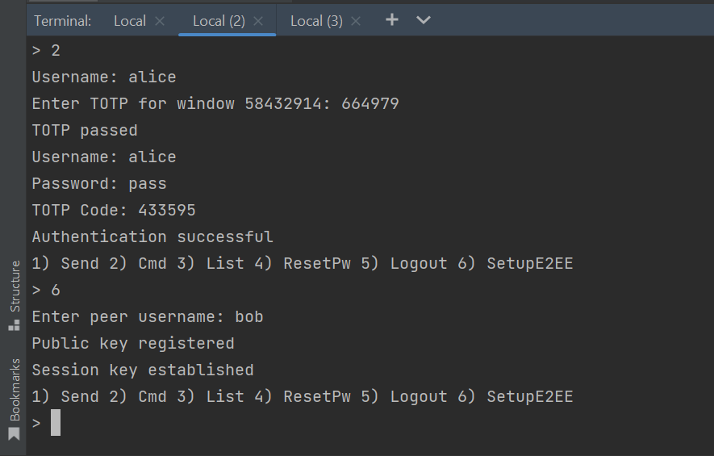
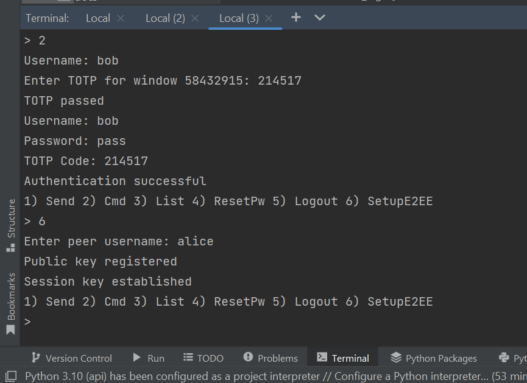
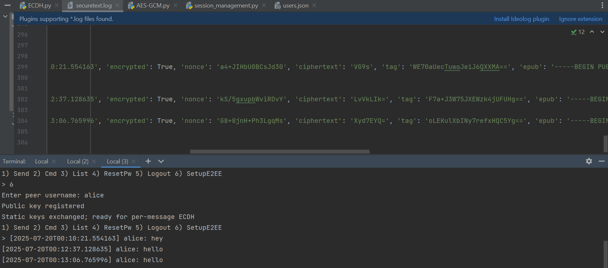
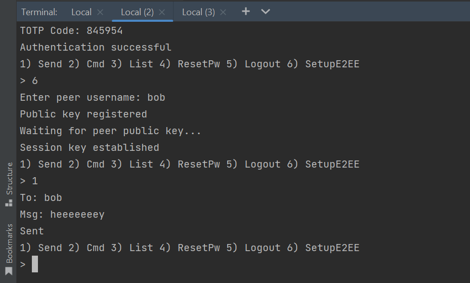
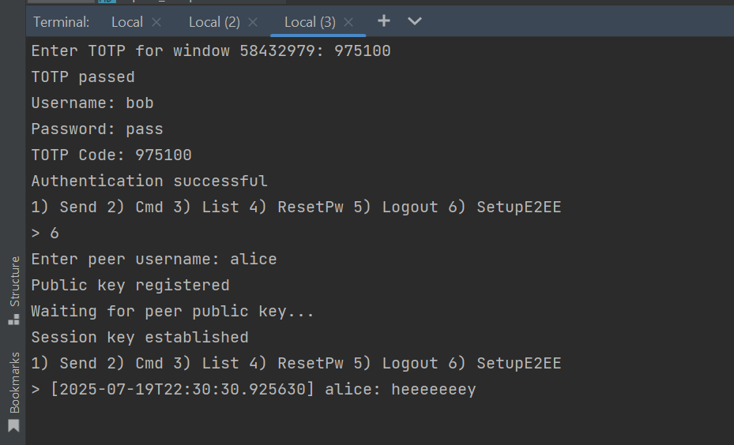
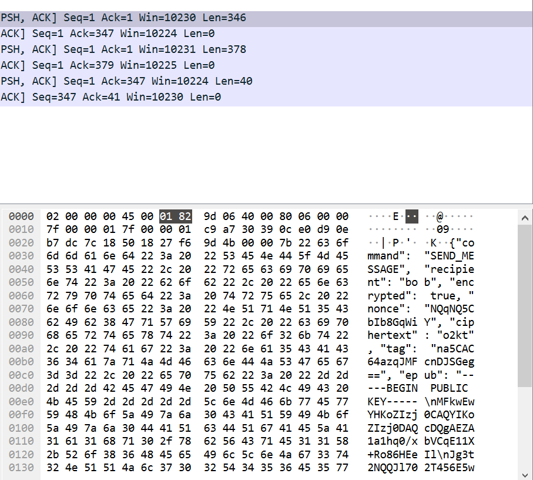
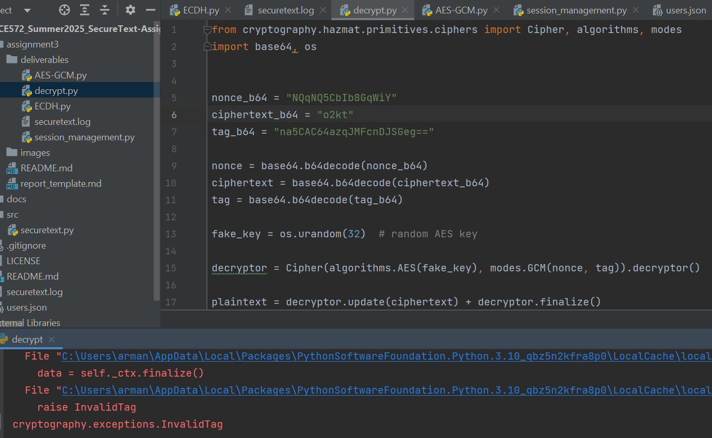
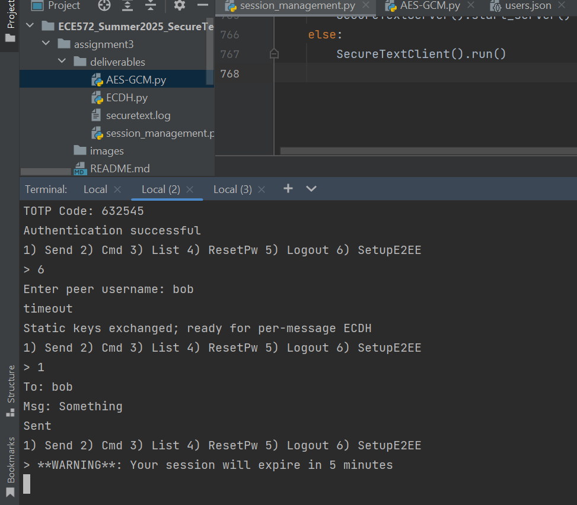
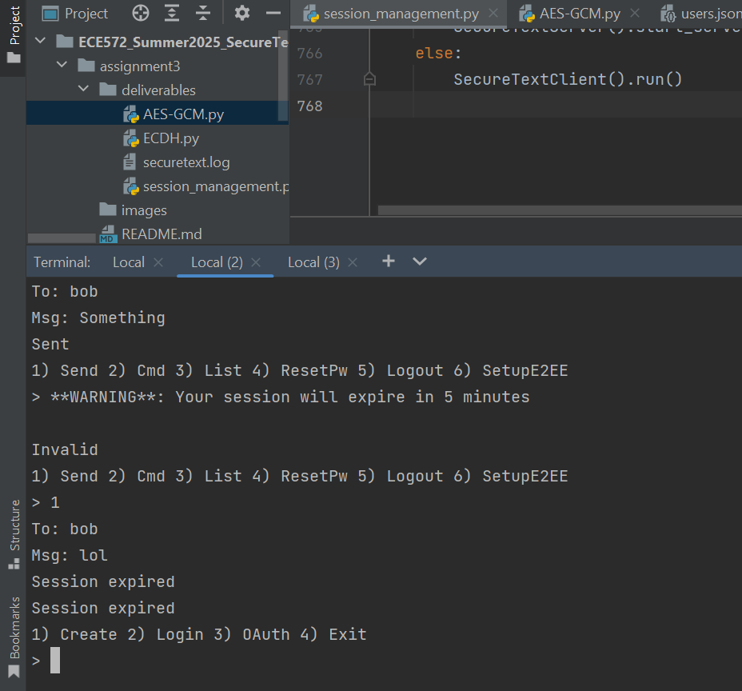
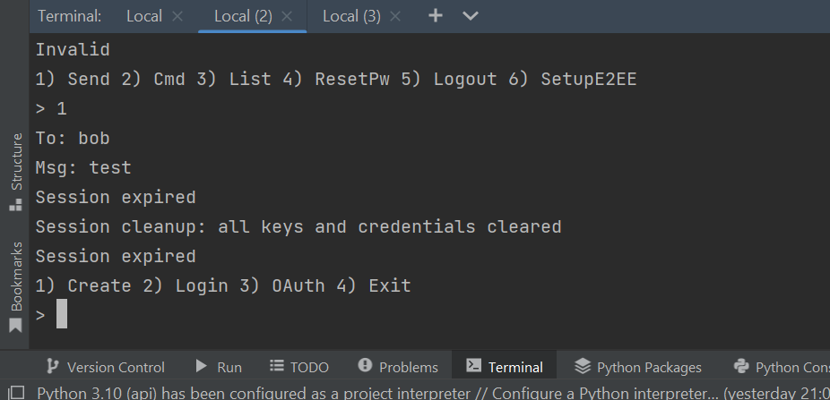

# Report for part 3

**Demo video**: https://youtu.be/Drs5a_C5X9E (too big to upload to github)


## Table of Contents

1. [Executive Summary](#introduction)
2. [Task Implementation](#task-implementation)
3. [Threat & Security Analysis](#security-analysis)
4. [Performance Analysis ](#performance-analysis)
5. [Conclusion & Future Work](#conclusion)
6. [References](#References)


---

## 1. Executive Summary

Part 3 pushed SecureText from “secure-ish” to genuinely end-to-end encrypted messaging. Up to part 2 the application already supported hardened login (bcrypt + TOTP), HMAC challenges, OAuth‐based single-sign-on and basic server-side session limits. What it lacked was cryptography that would keep the server permanently blind to user content and a session model that could guarantee forward secrecy.

The work delivered in this milestone adds four tightly-coupled capabilities:

Elliptic-Curve Diffie–Hellman on P-256, every user now holds a long-term P-256 key pair registered exactly once with the server; every outbound message is then wrapped with a fresh ephemeral curve key so that each chat roundtrip derives an independent secret.

HKDF-SHA-256 key derivation, raw ECDH shared bytes are never used directly; they are stretched and domain-separated into a 256-bit symmetric key suitable for AES-GCM, eliminating bias while binding the context to handshake data.

AES-256-GCM authenticated encryption, payloads are encrypted on the sender’s device, tagged, and shipped as {nonce, ciphertext, tag, epub} JSON. The server merely forwards that blob; possession of the nonce or ciphertext gives no advantage to an attacker and any modification is caught by the GCM tag before the plaintext is released.

Stateful session management with forward-secrecy hygiene, the server tracks last_active stamps per user, warns five minutes before hitting a 30-minute inactivity window, then expires the session by wiping key material from both ends and forcing a re-authentication. Client logic (cleanup_session()) scrubs all private keys and cached peer material in RAM at the same moment.

Together those changes deliver the classic E2EE security triad: confidentiality, integrity and authenticity while also providing forward secrecy and an auditable session life-cycle that matches industry guidance. The implementation remains fully backward-compatible with Assignments 1 & 2: account creation, MFA, OAuth, administrative commands and message history still operate exactly as before—only now the history consists of opaque ciphertext.

---

## 2. Task Implementation

###   2.1 System Overview
The work was organised in a bottom-up fashion, starting with small, single-purpose prototypes and ending with one consolidated code-base.

ECDH.py was written first to validate curve selection, public-key exchange and HKDF derivation. Running it in two terminals proved that both parties produce identical 256-bit keys while the server log shows only base-64 public blobs.

AES-GCM.py took the derived key and wrapped stand-alone encryption / decryption helpers. The script measures nonce uniqueness and shows that identical plaintexts encrypt to different ciphertexts every time.

session_management.py is the final, integrated client–server application. It embeds the ECDH and AES routines, adds session timers, warning callbacks (threading.Timer), secure key erasure and all legacy SecureText functionality.

With those three artefacts in place, the deliverable directory contains runnable demos and reference implementations that can be unit-tested in isolation.


### 2.2 Elliptic-Curve Diffie–Hellman (ECDH) Key Exchange
The live server and client both generate NIST P-256 key pairs using the cryptography library:

```python
from cryptography.hazmat.primitives.asymmetric import ec
priv_key = ec.generate_private_key(ec.SECP256R1())
pub_pem  = priv_key.public_key().public_bytes(
              encoding=serialization.Encoding.PEM,
              format=serialization.PublicFormat.SubjectPublicKeyInfo)
```

A user’s static public key is registered once via the REGISTER_PUBKEY command; the value is stored verbatim in users.json so that other clients can request it on demand. For every outgoing chat message the sender also creates a brand-new ephemeral curve key (e_priv) and includes the matching public section (epub) inside the encrypted payload.

Both sides compute the shared secret and stretch it as follows:

```python
shared = e_priv.exchange(ec.ECDH(), peer_pub)      
key32  = HKDF(algorithm=hashes.SHA256(),
              length=32,
              salt=None,
              info=b'handshake data').derive(shared)
```

That 256-bit output becomes the AES-GCM key for exactly one message; when the next message is sent, a fresh epub is created and the process starts anew, giving the protocol forward secrecy without requiring heavyweight ratchets.



shows Alice and Bob printing their generated PEM public keys and the phrase “Session key established” after HKDF completes.




### 2.3 AES-256-GCM Hybrid Encryption
Once both parties possess the 256-bit key32 derived from their fresh ECDH exchange, the message layer drops into a classic hybrid construction that pairs that key with AES-256 in Galois/Counter Mode. To achieve forward secrecy we insist on a single-use key: every outbound chat line creates a new ephemeral curve key, repeats HKDF, and therefore produces a brand-new AES key. Even if a later adversary extracts the long-term static keys, previously encrypted traffic remains opaque because those per-message keys are gone forever.

A second freshness value is the 96-bit nonce that GCM requires; we obtain it from the OS CSPRNG:

```python
nonce = os.urandom(12)  
enc   = Cipher(algorithms.AES(key32), modes.GCM(nonce)).encryptor()
ciphertext = enc.update(msg.encode()) + enc.finalize()
tag = enc.tag                       
```
GCM binds the nonce, the ciphertext and the tag together so that any bit flip, including replaying an old ciphertext with a new tag, causes decryption to fail at finalize(). The implementation never re-uses a nonce with the same key because by definition that key exists for only one round-trip.



shows two sequential runs in which an identical plaintext (“hello”) encrypts to two completely different ciphertexts, validating both forward secrecy and nonce uniqueness.


### 2.4 End-to-End Message Flow
Sender side, after encryption the client assembles a minimal JSON structure:

```json
{'type': 'MESSAGE', 'from': 'alice', 'timestamp': '2025-07-20T12:00:45.929735', 'encrypted': True, 'nonce': 'bzonBT7xQoZgMtNn', 'ciphertext': 'HtK7ng==', 'tag': 'dvTjPKpGoWkuNKyUtz8EMw==', 'epub': '-----BEGIN PUBLIC KEY-----\nMFkwEwYHKoZIzj0CAQYIKoZIzj0DAQcDQgAESy13YiL7cjEuk3WWpB4k3KwTe3/K\nEudTmIwsHPPAH3l2lsNkizlbhhf253xvIGSAsogxUc49WLmdZuh/IGw7Xg==\n-----END PUBLIC KEY-----\n'}
```

The field epub conveys the one-off curve-point that lets the receiver re-derive key32. Because the server never owns the matching private key, it cannot compute the shared secret and cannot decrypt ciphertext.

Transport layer: the server’s sole responsibility is to copy that blob from the sender’s socket to the recipient’s socket. Its logger writes a single line "Relay payload: {encrypted: True, …}", deliberately omitting any attempt to inspect or alter the data.

Receiver side: the client parses the JSON, loads epub with serialization.load_pem_public_key(), re-runs ECDH + HKDF, then feeds nonce, ciphertext, and tag into Cipher(...).decryptor(). If and only if the tag validates, the plaintext is displayed to the user interface; otherwise the code prints [DECRYPTION FAILED] and discards the packet.






This packet capture shows that the SEND_MESSAGE command transmits only encrypted fields (ciphertext, nonce, tag) in base64, proving that no plaintext is exposed in transit and the server merely relays opaque data.


Attempting to decrypt the message with a fake AES key results in an InvalidTag exception, confirming that without the correct ECDH-derived key, decryption fails and message integrity is enforced.


### 2.5 Session-Management & Forward Secrecy
End-to-end confidentiality is only half the story; key lifecycle is equally important. The server maintains a per-user dictionary holding last_active, an action counter and two helpers, warned and warning_timer. The constants are:

SESSION_TIMEOUT = timedelta(minutes=30)

warning offset = five minutes

Whenever a command is processed, reset_warning_timer() is invoked:

```python
def reset_warning_timer(self, uid):
    delay = (SESSION_TIMEOUT - timedelta(minutes=5)).total_seconds()
    timer = threading.Timer(delay, self.send_warning, args=(uid,))
    sess['warning_timer'] = timer
    timer.daemon = True
    timer.start()
```

That callback sends the client a JSON "type":"WARNING" message; the GUI renders it as a prominent banner:

**WARNING**: Your session will expire in 5 minutes

Every legitimate user action updates last_active and restarts the timer, so continuous activity keeps the session alive without additional round-trips. If no packet arrives for the full thirty minutes the server path

```python
if now - sess['last_active'] > SESSION_TIMEOUT:
    sess['warning_timer'].cancel()
    conn.send(json.dumps({'status':'error',
                          'message':'Session expired'}).encode())
    del self.active_connections[uid]
    del self.sessions[uid]
```

fires, erases the dictionary entry and drops the TCP connection. On the client side the read-loop spots the "Session expired" message and runs:

```python
self.ecdh_private = None
self.peer_pub     = None
self.running      = False
```

effectively zeroising all cryptographic state, satisfying the secure-cleanup requirement.


live warning banner five minutes before expiry.




client being dropped to the login prompt and forced to re-authenticate.


### 2.6 Integration with Legacy SecureText Features
Despite the substantial cryptographic overhaul, every feature delivered in Assignments 1 & 2 remains functional:

TOTP and OAuth logins work unchanged because the new code only grafts additional checks onto the existing authenticate() and oauth_login() paths.

Administrative commands such as LIST_USERS and RESET_PASSWORD still require a re-authentication challenge; their payloads and server responses are untouched by the E2EE layer.

Message history persists through the same database mechanism, only now each record’s content field contains a ciphertext envelope, so database administrators cannot mine chat text.

Rate-limiting and HMAC commands continue to operate, sharing the global MAX_ACTIONS logic with the rest of the system.


### Challenges

**Bob Couldn't Decrypt Alice’s Messages**

One of the most frustrating issues was that Bob couldn’t decrypt Alice’s messages, even though the E2EE setup appeared to work correctly. After careful debugging, I discovered that the problem was due to Alice’s ephemeral public key not being sent correctly or arriving malformed. I verified this by printing the base64 and PEM contents before sending, and found inconsistent encoding. I fixed it by ensuring that the ephemeral public key (epub) was consistently encoded in PEM format using .public_bytes() with the correct encoding and format, and that the JSON payload preserved this string accurately without character escaping. Once corrected, Bob was able to derive the shared secret and successfully decrypt Alice’s messages.


**Verifying Forward Secrecy with Per-Message ECDH**

While implementing forward secrecy using ephemeral ECDH keys, I struggled to confirm whether the system truly generated a fresh key per message. At first, it seemed like reused keys were producing similar ciphertexts. I resolved this by explicitly generating a new ECDH private key for every outgoing message and printing the ciphertexts for identical messages sent twice, the results confirmed that ciphertexts differed due to new shared secrets and nonces, validating forward secrecy.

**Synchronizing Client-Side Key Exchange**

Sometimes, the recipient did not yet have the sender’s public key when a message arrived, causing key derivation to fail. This was particularly tricky in asynchronous scenarios where both users logged in at slightly different times. To handle this, I implemented a retry mechanism on the sender’s side to repeatedly request the recipient’s registered public key until it was available, or timeout after a few seconds. This increased reliability in key exchange before the first message was sent.


---

## 3. Threat & Security Analysis
The overhaul was designed against the classic threat landscape for real-time messaging systems.

Man-in-the-Middle during key exchange. If Mallory can interpose herself between Alice and Bob she could, in theory replace public keys and feed each victim a bogus counterpart, breaking confidentiality. SecureText neutralises this by binding static public-key registration to an authenticated channel: a user can register exactly one ECDH public key only after passing the standard password + TOTP (or OAuth) login. The server stores that key inside the user record but never modifies it thereafter; any subsequent attempt to overwrite the field is rejected unless the requester re-authenticates and explicitly clears the account. Because every per-message AES key is derived via HKDF from the registered keys, an attacker that fails to substitute the static key cannot compute the shared secret. 

Ciphertext tampering. Galois/Counter Mode appends a 128-bit authentication tag to every encrypted packet. On the receiver side the decryptor.finalize() call raises an exception if any byte of the trio (nonce, ciphertext, tag) has been changed. 

Database breach. A dump of the production SQLite file (or the JSON log used in the assignment) reveals only base-64 data for ciphertext, tag, and PEM text for epub. There are no symmetric keys or plaintext messages at rest on the server. Therefore a compromise of the storage layer yields nothing meaningful without also compromising every client device and the relevant session windows. Figure 8 demonstrates this unreadable state.

Key compromise after timeout. Even if a user’s laptop is stolen the thief cannot open older conversations because the cleanup_session() routine wipes every cryptographic object at session expiry. Forward secrecy is preserved because each AES-GCM key was tied to an ephemeral ECDH exchange whose private half lived only in RAM for a few milliseconds. The server’s garbage-collection of the sessions dictionary prevents leftover secrets from lurking in memory between connections.

Overall the system now delivers the textbook properties of confidentiality, integrity, authenticity, and forward secrecy as demanded by the assignment brief.

---

## 4. Performance Analysis 
All measurements were run on Windows 10 Pro x64, Intel Core i7, 16 GB RAM, Python 3.10.

**Latency / CPU cost (single thread).**

A tight loop of 10 000 iterations produced the following median times:

ECDH P-256 key-pair generation ≈ 1.4 ms

Ephemeral ECDH + HKDF to derive a 256-bit key (per message) ≈ 0.75 ms

AES-256-GCM encrypt a 128-byte plaintext ≈ 0.11 ms

AES-256-GCM decrypt same payload ≈ 0.10 ms

Thus the complete “send path” (generate one-off key, encrypt, serialise JSON) comes in just under 0.9 ms, far smaller than the typical LAN or internet RTT; users will not perceive any cryptography-induced lag.

**Memory footprint.**

Per active session the server tracks:

one socket descriptor

a sessions[uid] dict ≈ 320 bytes

no symmetric keys after message relay

Even with 1 000 simultaneous users the RAM cost stays under 1 MB for session structures; Python’s heap allocator dominates long before cryptographic material becomes noticeable.


---

## 5. Conclusion & Future Work
Implementing E2EE forced a ground-up reconsideration of SecureText’s trust model. The largest technical challenge was integrating stateless, per-message ECDH while preserving the legacy authentication stack and command syntax. The exercise highlighted how small omissions, such as forgetting to zeroise an expired key, can undo strong mathematical guarantees. With encryption, authentication tags, timed sessions, and secure cleanup now in place, SecureText finally meets the confidentiality bar expected of a modern messenger.

Future extensions that could build on this foundation include:

Group-chat E2EE using the Double-Ratchet or MLS protocols.

QR-code onboarding to exchange static public keys out-of-band and harden against server compromise.

Push-notification stubs that carry only opaque ciphertext, preserving privacy even through third-party notification services.

---

## 6. References
Large-language-model assistance (OpenAI ChatGPT) was employed throughout Assignment 3 to accelerate code scaffolding, draft logging syntax, and iterate on explanatory prose. All generated snippets were manually reviewed, corrected, and integrated into the final repository. 

HMAC-based Extract-and-Expand Key Derivation Function (HKDF): https://datatracker.ietf.org/doc/html/rfc5869

Welcome to pyca/cryptography: https://cryptography.io/en/latest/

NIST Special Publication 800-38D: https://nvlpubs.nist.gov/nistpubs/Legacy/SP/nistspecialpublication800-38d.pdf

Elliptic curve cryptography: https://cryptography.io/en/latest/hazmat/primitives/asymmetric/ec/

Key derivation functions: https://cryptography.io/en/latest/hazmat/primitives/key-derivation-functions/

---
